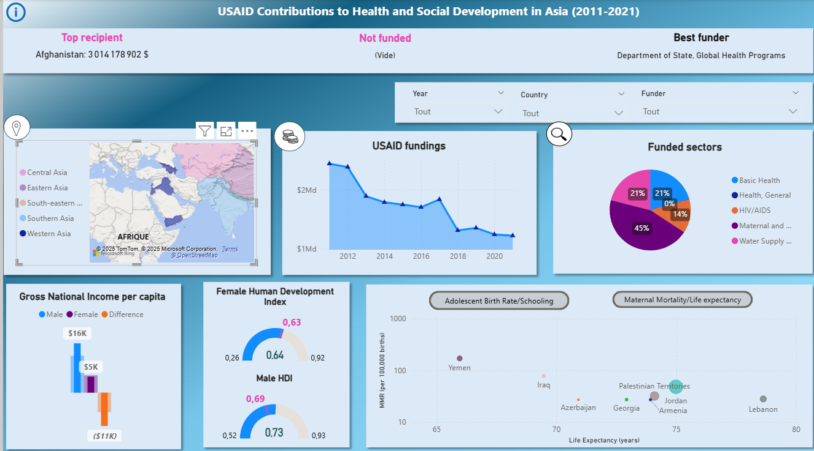

<!-- TABLE OF CONTENTS -->

  
Table of Contents

  <ol>
    <li>
      <a href="#about-the-project">About The Project</a>
      <ul>
        <li><a href="#built-with">Built With</a></li>
      </ul>
    </li>
    <li>
      <a href="#getting-started">Getting Started</a>
      <ul>
        <li><a href="#prerequisites">Prerequisites</a></li>
      </ul>
    </li>
    <li><a href="#usage">Usage</a></li>
    <li><a href="#contact">Contact</a></li>
    <li><a href="#acknowledgments">Acknowledgments</a></li>
  </ol>

<!-- ABOUT THE PROJECT -->
## The Project : 📊 USAID Health Aid Analysis Dashboard
A Power BI dashboard exploring health sector funding by USAID in Asia (2011–2021), combined with social development indicators to uncover regional trends and gender disparities.

In 2025, the U.S. government dismantled a federal agency that was responsible for nearly 50% of the world’s humanitarian aid. That agency, USAID (U.S. Agency for International Development), had long been the largest global donor of humanitarian assistance, contributing billions of dollars each year to development efforts in sectors such as health, defense, and the economy.

Key trends highlighted in the dashboard include:
- Across the 2011-2021 period, women in recipient countries earned, on average, only about 50% of what men earned. (GNP per capita)
- From 2011 to 2021, there was a gradual decline in funding, interrupted only by a temporary rebound in 2017
- Although Afghanistan was the top recipient of funding during the period, its development indicators remain the poorest among all beneficiary countries, with particularly low life expectancy and the highest maternal mortality rate.

### Built With

The dashboard was entirely built using Microsoft Power BI Desktop.

 <!-- [![PowerBI][PowerBI]][Next-url]ABOUT THE PROJECT -->

(<a href="#readme-top">back to top</a>)

<!-- GETTING STARTED -->
## 🚀 Getting Started
1. Download all CSV files to a local or online location
2. In Power BI, open the dashboard and update each file's source path in the Power Query Editor

### Prerequisites

To view and interact with the dashboard, you must have Microsoft Power BI Desktop [Microsoft Power BI Desktop](https://powerbi.microsoft.com/desktop/) installed on your computer.

<!-- USAGE EXAMPLES -->
## Usage

 All usages :
- Custom continent filter to reuse the dashboard for other regions
- Interactive exploration of USAID health funding by country and year
- Comparison of male vs. female GNP per capita
- Analysis of life expectancy and maternal mortality in recipient countries
- Analysis of mean years of school and adolescent birth rate in recipient countries

The dashboard can be adapted to display funding and social development indicators for other regions. To do this, open the pbix and go to the "Transform data" section and, for each table, modify the filtered row step to apply the desired continent filter.

(<a href="#readme-top">back to top</a>)

<!-- CONTACT -->
## Contact

- [@linkedin_Charlotte Gauthier Boma](https://www.linkedin.com/in/charlotte-gauthier-boma-9a4644a9/) 

- Project Link: [https://github.com/CharlotteGauthierBoma/USAID_Health-SocialDev_Asia](https://github.com/CharlotteGauthierBoma/USAID_Health-SocialDev_Asia)

(<a href="#readme-top">back to top</a>)

<!-- ACKNOWLEDGMENTS -->
## Acknowledgments

Sources that have been very helpful !

* [Chaîne Youtube How to Power BI](https://www.youtube.com/watch?v=v6fP8gyCLLc)

(<a href="#readme-top">back to top</a>)

<!-- MARKDOWN LINKS & IMAGES -->
<!-- https://www.markdownguide.org/basic-syntax/#reference-style-links -->
[PowerBI]: https://logos-marcas.com/wp-content/uploads/2022/01/Power-BI-Emblema.jpg
[Next-url]:https://logos-marcas.com/wp-content/uploads/2022/01/Power-BI-Emblema.jpg